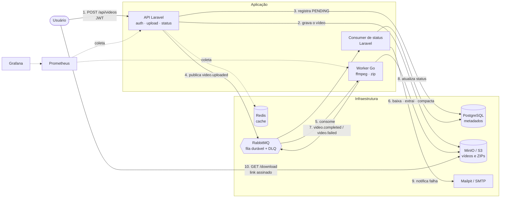
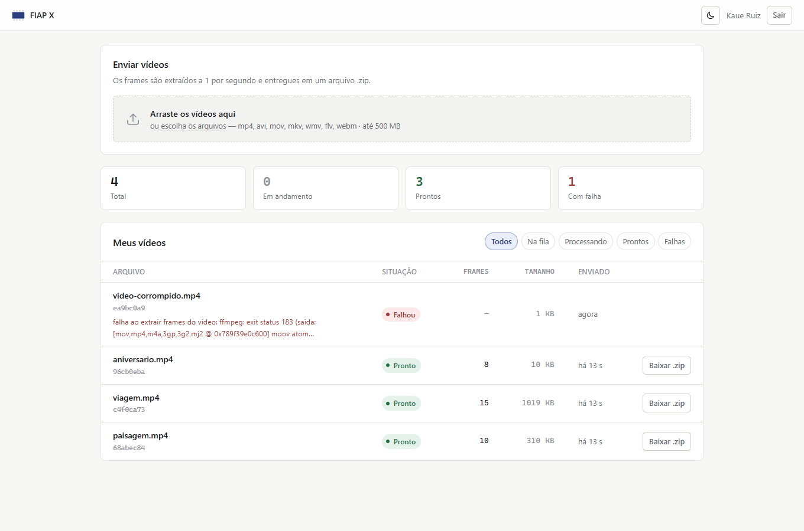

# FIAP X — Sistema de Processamento de Vídeos

Hackathon · POSTECH 13SOAT · Fase 5

Sistema distribuído que recebe vídeos, extrai os frames e devolve um arquivo `.zip`
para download. É a evolução arquitetural do projeto apresentado aos investidores,
preservado em [`legacy/`](legacy/) como referência do ponto de partida.

---

## O problema com o projeto base

O projeto original ([`legacy/main.go`](legacy/main.go)) resolve o caso de uso em ~500 linhas
num único arquivo, mas não sustenta operação real:

| Limitação do projeto base | Consequência |
|---|---|
| Processamento **síncrono** dentro do request HTTP | Uma requisição prende o servidor por minutos |
| Arquivos em **disco local** | Impossível rodar mais de uma instância |
| **Sem autenticação** | Qualquer um lê o ZIP de qualquer outro |
| **Sem banco de dados** | Estado inferido de nomes de arquivo com `filepath.Glob` |
| **Sem fila** | Um pico derruba requisições; uma falha perde o trabalho |
| **Sem testes** | Nenhuma rede de segurança para evoluir |
| `CMD ["go", "run"]` no Dockerfile | Compila a cada boot, com o toolchain inteiro em produção |

## A solução



### Por que dois serviços em linguagens diferentes

A extração de frames é trabalho de CPU longo, e a API é trabalho de I/O curto.
Separá-los permite escalar cada um pelo seu próprio gargalo — e o worker herda
diretamente a lógica de `ffmpeg` + ZIP do projeto base, agora em Clean Architecture.
Ver [ADR-002](docs/architecture/ADR-002-worker-em-go.md).

---

## Como os requisitos do desafio foram atendidos

| Requisito | Implementação | Onde verificar |
|---|---|---|
| Processar **mais de um vídeo ao mesmo tempo** | N réplicas do worker × `WORKER_PREFETCH` jobs por réplica | [`consumer.go`](worker/internal/adapter/messaging/consumer.go) |
| **Não perder requisição** em picos | Exchange e fila duráveis, mensagens persistentes, ack manual, DLQ e retentativas | [`topology.go`](worker/internal/adapter/messaging/topology.go) |
| Proteção por **usuário e senha** | Cadastro/login com bcrypt e JWT HS256 em todas as rotas de vídeo | [`AuthController`](api/app/Http/Controllers/Api/AuthController.php) |
| **Listagem de status** por usuário | `GET /api/videos` paginado, com filtro por status e isolamento por dono | [`VideoController`](api/app/Http/Controllers/Api/VideoController.php) |
| **Notificação de erro** | E-mail disparado ao esgotar as tentativas | [`VideoStatusUpdater`](api/app/Services/VideoStatusUpdater.php) |
| **Persistir os dados** | PostgreSQL com o schema versionado | [`schema.sql`](database/schema.sql) |
| Arquitetura **escalável** | Serviços sem estado, HPA de 2→20 réplicas, storage externo | [`30-hpa-ingress.yaml`](k8s/30-hpa-ingress.yaml) |
| **Testes** de qualidade | 55 testes na API + 29 no worker, com gate de 80% no CI | [`ci.yml`](.github/workflows/ci.yml) |
| **CI/CD** | Lint, testes, cobertura, integração ponta a ponta, build e deploy | [`.github/workflows/`](.github/workflows/) |

Stack alinhada à recomendação do enunciado: **Docker + Kubernetes**, **RabbitMQ**,
**PostgreSQL + Redis**, **Prometheus + Grafana** e **GitHub Actions**.

---

## Executando localmente

Pré-requisitos: Docker e Docker Compose. Nada mais precisa estar instalado —
Go, PHP e ffmpeg rodam dentro dos containers.

```bash
cp .env.example .env
# Edite .env e defina APP_KEY (32 bytes em base64) e JWT_SECRET

docker compose up -d --build
docker compose exec api php artisan migrate --force
```

| Serviço | URL | Credenciais |
|---|---|---|
| **Interface web** | **http://localhost:8080** | crie a conta na própria tela |
| API | http://localhost:8080/api | — |
| RabbitMQ | http://localhost:15672 | `fiapx` / `fiapx` |
| MinIO | http://localhost:9001 | `fiapxadmin` / `fiapxadmin123` |
| Mailpit (e-mails) | http://localhost:8025 | — |
| Prometheus | http://localhost:9090 | — |
| Grafana | http://localhost:3001 | `admin` / `admin` |

### Validando a instalação

```bash
bash scripts/smoke-test.sh
```

Exercita o fluxo completo contra a stack real: cadastro, bloqueio sem token,
três uploads simultâneos, download do ZIP, e o caminho de erro terminando em
`FAILED` com e-mail enviado e mensagem isolada na DLQ.

### Demonstrando o processamento paralelo

```bash
docker compose up -d --scale worker=3
```

As réplicas dividem a fila automaticamente — o RabbitMQ entrega no máximo
`WORKER_PREFETCH` mensagens não confirmadas por consumidor.

---

## Usando o sistema

A forma mais direta é pela **interface web em http://localhost:8080** — cadastro,
envio por arrastar e soltar, acompanhamento do status atualizando sozinho e
download do ZIP. É a mesma API REST por trás, consumida do navegador.



### Pela API

```bash
# 1. Cadastro
curl -X POST http://localhost:8080/api/auth/register \
  -H 'Content-Type: application/json' \
  -d '{"name":"Kaue","email":"kaue@fiapx.test","password":"senhaSegura1","password_confirmation":"senhaSegura1"}'

# 2. Login
TOKEN=$(curl -s -X POST http://localhost:8080/api/auth/login \
  -H 'Content-Type: application/json' \
  -d '{"email":"kaue@fiapx.test","password":"senhaSegura1"}' | jq -r .token)

# 3. Upload — responde 202 imediatamente
curl -X POST http://localhost:8080/api/videos \
  -H "Authorization: Bearer $TOKEN" \
  -F "video=@meu-video.mp4"

# 4. Status
curl http://localhost:8080/api/videos -H "Authorization: Bearer $TOKEN"

# 5. Download — devolve um link assinado válido por 15 minutos
curl http://localhost:8080/api/videos/{id}/download -H "Authorization: Bearer $TOKEN"
```

Contrato completo em [`docs/api/openapi.yaml`](docs/api/openapi.yaml).

| Método | Rota | Descrição |
|---|---|---|
| `POST` | `/api/auth/register` | Cria conta e devolve JWT |
| `POST` | `/api/auth/login` | Autentica e devolve JWT |
| `GET` | `/api/auth/me` | Dados do usuário do token |
| `POST` | `/api/videos` | Envia um vídeo (202 Accepted) |
| `GET` | `/api/videos` | Lista os vídeos do usuário |
| `GET` | `/api/videos/{id}` | Detalhe de um vídeo |
| `GET` | `/api/videos/{id}/download` | Link assinado para o ZIP |
| `GET` | `/api/health` · `/api/ready` · `/api/metrics` | Probes e métricas |

---

## Deploy em Kubernetes

```bash
kubectl apply -f k8s/00-namespace.yaml
kubectl apply -f k8s/01-config.yaml    # ajuste os segredos antes
kubectl apply -f k8s/10-infra.yaml
kubectl apply -f k8s/20-api.yaml
kubectl apply -f k8s/21-worker.yaml
kubectl apply -f k8s/30-hpa-ingress.yaml
```

Em produção o `Secret` deve vir do pipeline ou de um gestor de segredos, nunca
do repositório — o `01-config.yaml` traz apenas um modelo para uso local.

---

## Testes

```bash
# API — 55 testes
docker compose exec api vendor/bin/phpunit

# Worker — 29 testes (39 casos contando os subtestes)
docker run --rm -v "$PWD/worker:/src" -w /src golang:1.23-alpine \
  sh -c "apk add --no-cache ffmpeg && go test ./... -cover"
```

Cobertura medida na última execução:

| Módulo | Cobertura |
|---|---|
| API (linhas) | **86,67%** |
| `worker/internal/config` | **100%** |
| `worker/internal/domain` | **90,9%** |
| `worker/internal/usecase` | **86,5%** |
| `worker/internal/adapter/video` | **84,8%** |

Os adaptadores de RabbitMQ e MinIO não têm teste unitário: dependem de broker e
storage reais e são exercitados pelo `smoke-test.sh` no job de integração do CI.

---

## Estrutura do repositório

```
.
├── api/                    API Laravel (autenticação, upload, status, download)
│   ├── app/
│   │   ├── Http/           controllers, requests, middleware (JWT, correlação)
│   │   ├── Messaging/      publisher e conexão AMQP
│   │   ├── Services/       regras de aplicação
│   │   └── Support/        emissão e validação de JWT
│   ├── docker/             Dockerfile de dev, de produção e config do nginx
│   └── tests/              55 testes (unitários e de feature)
├── worker/                 Worker Go (Clean Architecture)
│   ├── cmd/worker/         composition root
│   └── internal/
│       ├── domain/         entidades, erros e portas — sem dependências externas
│       ├── usecase/        orquestração do processamento
│       └── adapter/        ffmpeg, MinIO e RabbitMQ
├── k8s/                    manifestos (namespace, infra, workloads, HPA, ingress)
├── database/schema.sql     script de criação do banco
├── docs/
│   ├── api/openapi.yaml    contrato da API
│   └── architecture/       diagramas e ADRs
├── observability/          configuração do Prometheus e do Grafana
├── scripts/smoke-test.sh   validação ponta a ponta
├── legacy/                 projeto base recebido (referência do "antes")
└── docker-compose.yml      ambiente completo
```

---

## Decisões de arquitetura

| ADR | Decisão |
|---|---|
| [ADR-001](docs/architecture/ADR-001-processamento-assincrono.md) | Processamento assíncrono por fila |
| [ADR-002](docs/architecture/ADR-002-worker-em-go.md) | Worker em Go, API em Laravel |
| [ADR-003](docs/architecture/ADR-003-storage-de-objetos.md) | Storage de objetos em vez de disco local |
| [ADR-004](docs/architecture/ADR-004-jwt-hs256.md) | JWT HS256 com segredo compartilhado |
| [ADR-005](docs/architecture/ADR-005-retentativas-e-dlq.md) | Retentativas com classificação de erro e DLQ |

Documento de arquitetura completo, com diagramas de sequência e o modelo de
dados: [`docs/architecture/arquitetura.md`](docs/architecture/arquitetura.md).
