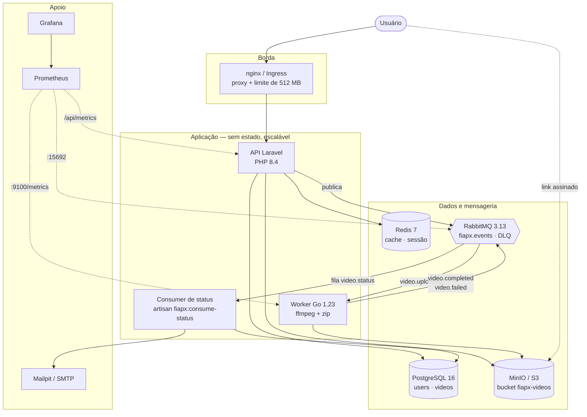
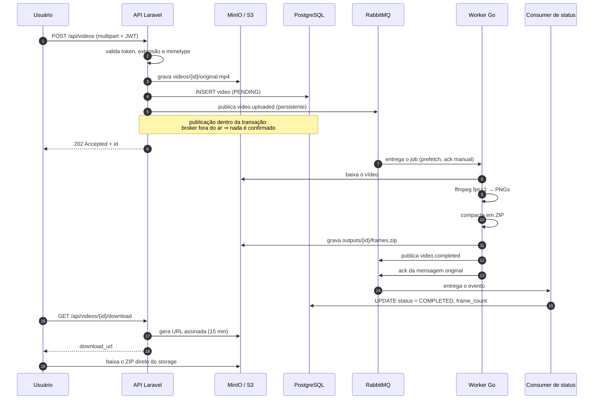
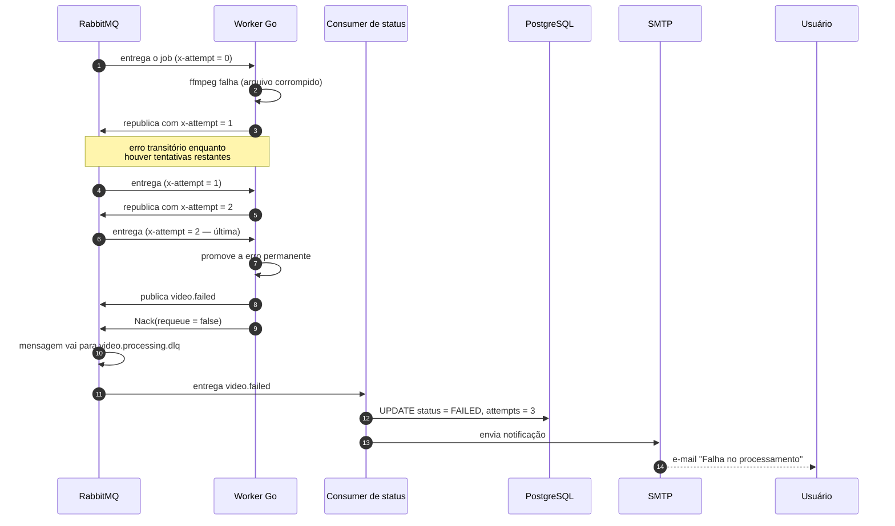
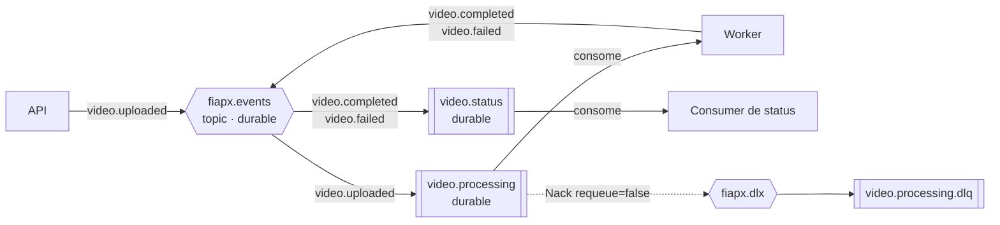
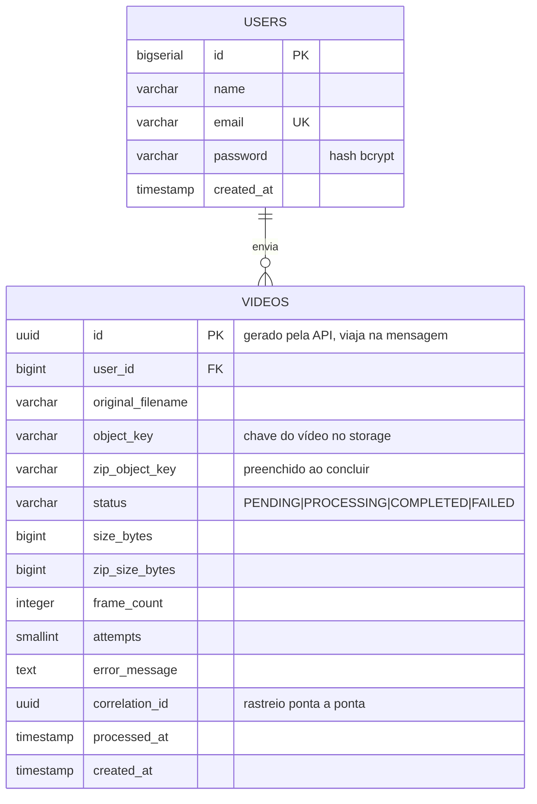

# Documentação de arquitetura — FIAP X

Hackathon · POSTECH 13SOAT · Fase 5

---

## 1. Visão de componentes

### Responsabilidade de cada serviço

| Serviço | Responsabilidade | Escala por |
|---|---|---|
| **API Laravel** | Autenticar, receber o vídeo, registrar o pedido, listar status, assinar o download | Tráfego HTTP (HPA por CPU/memória) |
| **Worker Go** | Baixar, extrair frames, compactar, devolver o ZIP e anunciar o desfecho | Tamanho da fila (HPA por CPU) |
| **Consumer de status** | Aplicar os eventos de resultado no banco e notificar falhas | Uma réplica basta |

---

## 2. Fluxo de sucesso

## 3. Fluxo de falha

---

## 4. Topologia de mensageria

| Objeto | Tipo | Papel |
|---|---|---|
| `fiapx.events` | exchange topic durável | Ponto único de publicação |
| `video.processing` | fila durável | Jobs aguardando o worker |
| `video.status` | fila durável | Resultados aguardando a API |
| `fiapx.dlx` + `video.processing.dlq` | dead letter | Isola o que falhou em definitivo |

**Garantias contra perda em pico:** exchange e filas duráveis, mensagens
publicadas com `delivery_mode = persistent`, *publisher confirms* no worker,
`autoAck = false` no consumo e `Qos(prefetch)` limitando o despacho por réplica.

---

## 5. Modelo de dados

### Justificativa das escolhas

**PostgreSQL** — o modelo é relacional e pequeno (dois agregados com uma relação
1:N), com necessidade de integridade referencial (`ON DELETE CASCADE`) e de
consultas por status. Também é o banco gerenciado disponível na maioria dos
provedores, com módulo Terraform já pronto das fases anteriores.

**UUID como chave de `videos`** — o identificador é gerado pela API antes de
qualquer escrita, viaja na mensagem AMQP, nomeia os objetos no storage e volta
nos eventos. Um `BIGSERIAL` exigiria gravar primeiro para só então conhecer a
chave, e exporia a contagem de vídeos do sistema na URL.

**Índices** — `(user_id, created_at)` cobre a consulta dominante (listagem do
usuário, mais recentes primeiro); `(user_id, status)` cobre o filtro por status;
`correlation_id` serve à investigação de incidentes.

**Redis** — cache e sessão. Não guarda estado de negócio: o `status` do vídeo é
lido do PostgreSQL, porque um cache desatualizado aqui mostraria "processando"
para um vídeo já pronto.

---

## 6. Observabilidade

| Sinal | Origem | Uso |
|---|---|---|
| `fiapx_videos_processados_total{resultado}` | Worker | Taxa de sucesso, retentativas e falhas permanentes |
| `fiapx_processamento_duracao_segundos` | Worker | Distribuição do tempo de processamento |
| `fiapx_videos_em_processamento` | Worker | Ocupação instantânea das réplicas |
| `fiapx_frames_por_video` | Worker | Perfil de carga dos vídeos recebidos |
| `fiapx_videos_total{status}` | API | Backlog visto pelo usuário |
| Filas e DLQ | RabbitMQ (`:15692`) | Acúmulo de fila — sinal para escalar |

**Logs estruturados em JSON** nos dois serviços (`slog` no Go, canal `stack` no
Laravel), com `correlation_id` propagado do header `X-Correlation-Id` da
requisição até o evento de resultado — o que permite reconstruir o caminho
completo de um upload através dos três serviços.

**Probes:** `/api/health` (liveness, sem dependências — banco fora do ar não deve
reiniciar o pod em laço) e `/api/ready` (readiness, verifica PostgreSQL e Redis).

---

## 7. Escalabilidade

| Dimensão | Mecanismo |
|---|---|
| Vazão de upload | HPA da API: 2 → 10 réplicas a 70% de CPU |
| Vazão de processamento | HPA do worker: 2 → 20 réplicas a 65% de CPU |
| Paralelismo por réplica | `WORKER_PREFETCH` jobs simultâneos, com semáforo do mesmo tamanho |
| Absorção de pico | Fila durável — o excedente vira backlog, não erro |
| Disponibilidade durante deploy | `maxUnavailable: 0` e PodDisruptionBudget na API |
| Encerramento sem perda | `terminationGracePeriodSeconds: 120` + ack manual |

O `scaleDown` do worker é deliberadamente lento (janela de 600s, 1 pod por vez):
derrubar uma réplica no meio de um ffmpeg custa reprocessar o vídeo inteiro.

**Evolução natural:** trocar o gatilho do HPA do worker de CPU para o tamanho da
fila `video.processing` via KEDA, que reage antes de a CPU subir.

---

## 8. Segurança

- Senhas em bcrypt; texto puro nunca é gravado nem devolvido nas respostas.
- Todas as rotas de vídeo exigem JWT válido, com o usuário confirmado no banco.
- Acesso restrito ao dono: recurso de outro usuário responde `404`.
- Upload validado por extensão **e** mimetype real, com limite de tamanho.
- Nome de arquivo enviado pelo usuário é normalizado com `filepath.Base` no
  worker, impedindo travessia de diretório.
- Throttle no login (5/min) e no cadastro (10/min).
- Links de download expiram em 15 minutos.
- Containers rodam com usuário não-root, e imagens de produção não carregam
  toolchain nem dependências de desenvolvimento.
- Segredos vêm de `Secret`/variáveis de ambiente, nunca do repositório.
